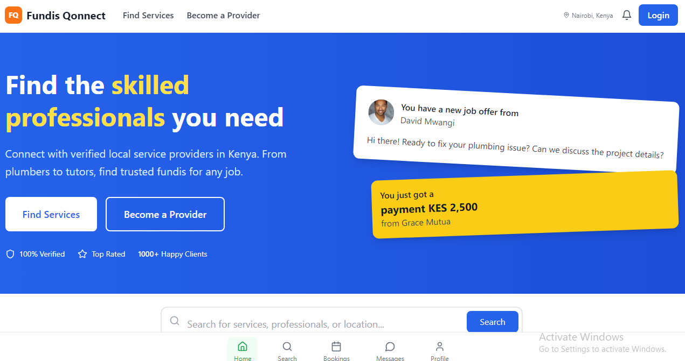

# Welcome to your My project

## Project info
## live link https://fundis-qonnect.netlify.app/
**Use your preferred IDE**

If you want to work locally using your own IDE, you can clone this repo and push changes. Pushed changes will also be reflected in Lovable.

The only requirement is having Node.js & npm installed - [install with nvm](https://github.com/nvm-sh/nvm#installing-and-updating)

Follow these steps:

```sh
# Step 1: Clone the repository using the project's Git URL.
git clone <YOUR_GIT_URL>

# Step 2: Navigate to the project directory.
cd <YOUR_PROJECT_NAME>

# Step 3: Install the necessary dependencies.
npm i

# Step 4: Start the development server with auto-reloading and an instant preview.
npm run dev
```

**Edit a file directly in GitHub**

- Navigate to the desired file(s).
- Click the "Edit" button (pencil icon) at the top right of the file view.
- Make your changes and commit the changes.

**Use GitHub Codespaces**

- Navigate to the main page of your repository.
- Click on the "Code" button (green button) near the top right.
- Select the "Codespaces" tab.
- Click on "New codespace" to launch a new Codespace environment.
- Edit files directly within the Codespace and commit and push your changes once you're done.

## What technologies are used for this project?

This project is built with:

- Vite
- TypeScript
- React
- shadcn-ui
- Tailwind CSS

# 🛠️ FundisQonnect

**FundisQonnect** is a web platform that connects clients with skilled local service providers — including fundis, cleaners, tutors, and other freelancers — in a fast, friendly, and trusted way. It simplifies **discovering**, **booking**, and **paying** for services online or via WhatsApp.

 <!-- Replace with actual screenshot if available -->

---

## 🚀 Features

- 🔍 **Search & Filter**: Find professionals by skill, location, or rating
- 🗓️ **Booking Interface**: Schedule jobs through WhatsApp or mobile web
- 💬 **WhatsApp Integration**: Seamless chat-based booking
- 💳 **M-Pesa Payments**: Embedded mobile payments (planned)
- 📦 **Supabase Backend**: Real-time database & authentication
- 🛡️ **User Auth**: Sign up/login with email (via Supabase)
- ⭐ **Ratings & Reviews**: Clients give feedback post-job

---

## 🧰 Tech Stack

| Layer        | Technology                             |
|--------------|-----------------------------------------|
| Frontend     | React (Vite), TailwindCSS, ShadCN UI    |
| Backend      | Supabase (PostgreSQL, Auth, Realtime)   |
| Auth         | Supabase Auth (Email/Password)          |
| Payments     | M-Pesa (Daraja API, planned)            |
| Deployment   | Netlify (Frontend), Supabase (Backend)  |

---

## 📂 Folder Structure

```bash
fundisqonnect/
├── public/
│   └── _redirects
├── src/
│   ├── components/
│   ├── pages/
│   ├── hooks/
│   ├── utils/
│   ├── assets/
│   ├── App.tsx
│   └── main.tsx
├── supabase/
│   └── schema.sql
├── vite.config.ts
└── README.md
🛠️ Getting Started
1. Clone the repo
bash
Copy
Edit
git clone https://github.com/your-username/fundisqonnect.git
cd fundisqonnect
2. Install dependencies
bash
Copy
Edit
npm install
3. Set up Supabase
Create a Supabase project

Copy your project's anon public key and URL

Create a .env file and add:

env
Copy
Edit
VITE_SUPABASE_URL=https://xyzcompany.supabase.co
VITE_SUPABASE_ANON_KEY=your-anon-key
4. Start development server
bash
Copy
Edit
npm run dev
🧪 Deployment
🔹 Frontend on Netlify
bash
Copy
Edit
npm run build
Then upload the dist/ folder to Netlify Drop

🔹 Backend on Supabase
Your Supabase project runs automatically in the cloud

Use Supabase Studio to manage users, bookings, and fundis

You can optionally version your schema in /supabase/schema.sql

📈 Upcoming Features
Admin dashboard to approve fundis

AI-based matching for best-fit service pros

SMS and WhatsApp reminders

Analytics dashboard for fundis

👩‍💻 Author
Maryliz Karumba
🌍 Nairobi, Kenya